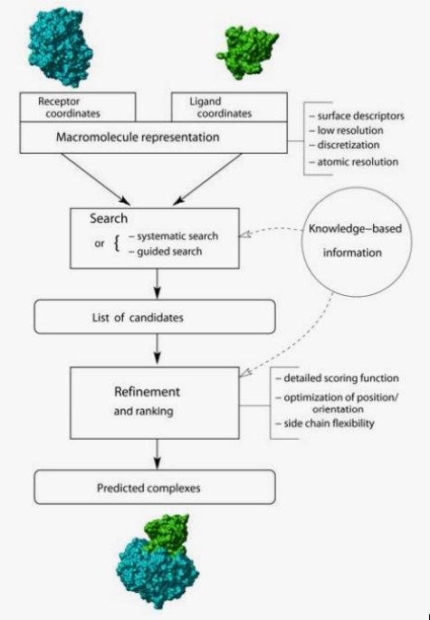

```{r,child="assets/header-lab.Rmd"}
```

Docking is the **prediction the structure of complexes** such as: 

- Protein-Ligand, Protein-Protein, Protein-NA, NA-Ligand, NA-NA

In order for these complexes to be formed, their integrants need to recognize each other in a **selective** and dynamic way, this is achieved by structural complementarity.

This prediction might be **useful to**:

- Understanding interactions, roles of specific amino acids, design of mutations and  changes of activity
- Comparison of affinities of different molecules
- Drug design


# Molecular Docking types

Docking approaches have to deal with the conformational changes between unbound and bound structures.

**Bound vs Unbound**

  - Bound: goal is to reproduce a known complex where the starting coordinates of the individual molecules are taken from the crystal of the complex
  - Unbound: significantly more difficult problem, the starting coordinates are taken from the unbound molecules

Early algorithms in order to be faster assumed that docked molecules do not change conformations, treating them as rigid bodies.

**Flexible vs Rigid**

  - Rigid: procedures that perform rigid body search
  - Felxible: procedures that consider possible conformational changes (protein flexibility)

Whether the binding site of molecules is known or not the search space will vary. Global docking ismore demanding in terms of computational time and the results are less accurate.

**Global vs Local**

  - Global: search for the location of the binding site and a search to figure out the exact  orientation of the ligand in the binding site.
  - Local: if binding site is known, we just need to orient the ligand in the binding site.

# Docking Strategy

<div class="pull-left-50">

- Protein representation

- Search method

- Scoring method

Scoring might be done during the search process, or a posteriori.

  - Structural complementarity
      - Robust, low resolution

  - Classical force-fields, Statistical Potentials
      - High resolution
      - Easy to transfer

  - Empirical functions
    - DGbind obtained from function fitted to experimental data
    - Based on vdW, electrostatic, hydrogen bonds, desolvation, enthropy, hydrophobicy, ...
    - Reproducing affinity of ligation

- Refinement?
  - Molecular Dynamics, ...

<div class="pull-right-50 text-center">

</div>
</div>


# Ligand-Protein Docking

Small-molecule docking

- **Molecular Docking**
  - Prediction of 3D structure of ligand-protein or protein-protein complexes.
  - One receptor – one or few ligands
  - Quality of the structure is the main objective. Realistic binding energies
  - Usually combined with other techniques, as MD
  - Experimental information can be considered
- **Virtual screening**
  - Identification of possible ligands from compound databases
  - One receptor – multiple ligands (> 10^6)
  - Calculation should be fast (>10000 ligand-receptor dockings / day / proc.)
  - The main objective is to select “some” ligands, that can be optimized with other methods
- **Reverse Screening**
  - Identification of possible receptors for a known ligand
  - One ligand - multiple receptors
  - Points to possible side effects
- **Active site prediction**
  - Identification of binding regions

• Complete atomic representation
  - Large cost, high resolution

• Simplified representations
- Quick and robust. Low resolution.

• 3D Grid representations (receptor)
- Easier energy calculation
- Definition of “pharmacophores” (MIPs)

• Flexibility (Ligand and receptor)
- Ensembl docking

# Protein docking

The approaches to protein-protein docking have a lot in common with small molecule docking

Still based on the combination of search algorithm coupled to a scoring function

Scoring functions are essentially the same (since we are still dealing with atomic interactions), however the major problem is that the conformational space we now need to search is massive

- Large systems: contact area: 1500-3000 A2 
- Large num of degrees of freedom + Large conformational flexibility 
- Few "easy" interactions 
  - Hydrophobic contacts 
  - Average 1 H-bond / 170A^2 
  - 1 water / 100 A2 

## "Pure" Ab initio docking 

- Only information about ligand and receptor structures is known 
  - Pseudo-random approaches (simulation, optimization) 
  - Directed search (Geometric hashing) 
  - Brute-Force approaches (Grid-based, FFT) 

ADDITIONAL TRICKS 

**Flexible docking**

- Traditional MD 
  - Refine structures after docking

- Conformational sampling 
  - Rigid docking with set of possible conformations (experimental)
  - Conformational search added to position and orientation (MC)

- Combined cycles of docking and simulation 

- RosettaDock combines rigid body MonteCarlo orientation/traslation + Montecarlo amon other rotamer libraries (very expensive) 

**Soft docking**

- Backbone is still rigid 

- Sidechain flexibility is mimicked using "soft" VdW potentials and/or coarser FFT grids 

## Data driven docking (template based) 

  - Experimental, homology data is used
    - Template based, using data from homologues 
  
  - Co-evolution methods (AlphaFold)
    - Protein structure prediction 
    - Uses data from "massive" MSA (Multiple Seq Alignment) and correlated mutations to define  correlated positions > 3D contacts (predicted contacts become restrains)
    
    
  
  - Interface prediction 
    - Reveal interfaces without structure prediction 

# Conclusion

- Protein docking works
  - (Much less efficient than ligand docking)
- Lots of methods exists, no clear winner
- Data-driven methods can generate better models if data is available
- Flexibility, conformational changes are the major problems
- Interface and interaction predictions (without docking) are possible and useful